


 

  

---

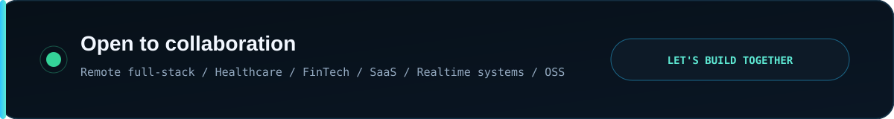

 

---

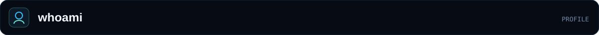

**Full-Stack Software Engineer** building modern software across the **frontend, backend, APIs, databases, and infrastructure**.

I turn real-world problems into **scalable, secure, reliable, and maintainable products**, with a focus on **SaaS, healthcare, pharmaceutical technology, payments, realtime systems, and AI-powered software**.

---

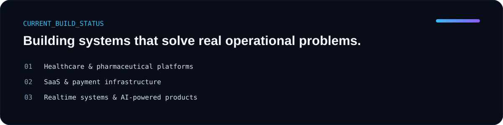

---

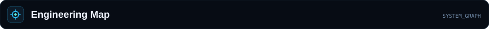


---

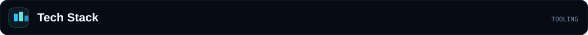


---

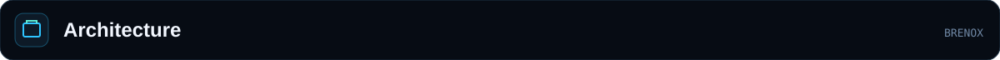

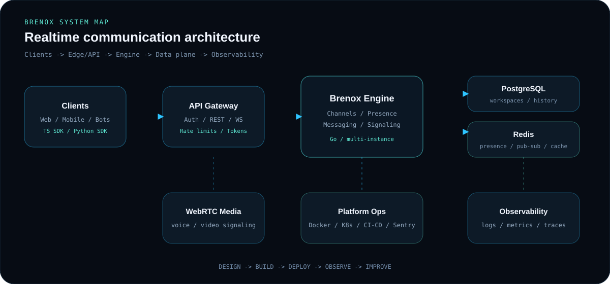

---

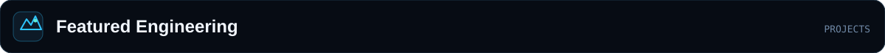

<a href="https://github.com/brainArt16/brenox-engine">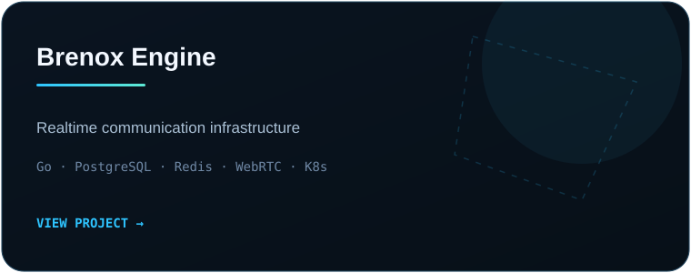</a>
<a href="https://github.com/brainArt16/brenox-sdk">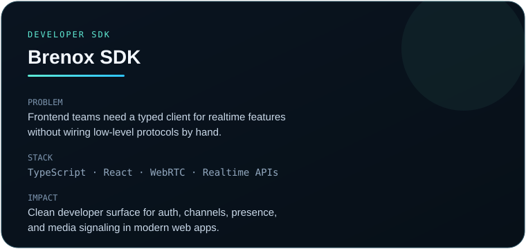</a>
 
<a href="https://github.com/brainArt16/brenox-python">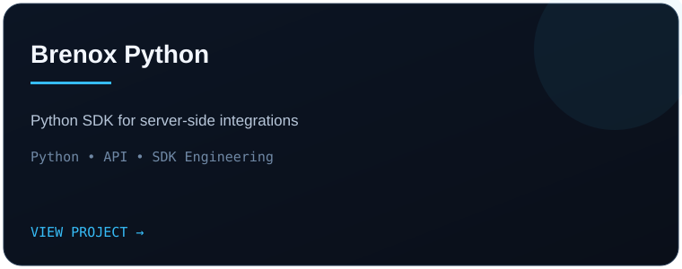</a>
<a href="https://github.com/brainArt16/ghost-factory">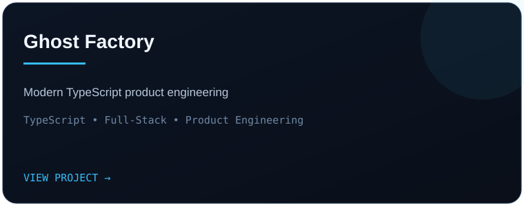</a>

---

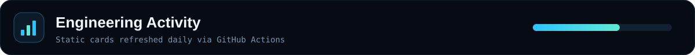


  


---

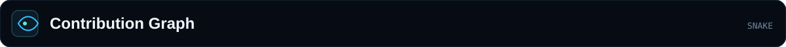

---

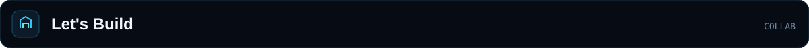

**Full-Stack Engineering · SaaS · Healthcare · Pharmaceutical Technology · FinTech · AI/ML · Realtime Systems · Open Source**

  

  

<code>Build • Ship • Learn • Improve</code>

