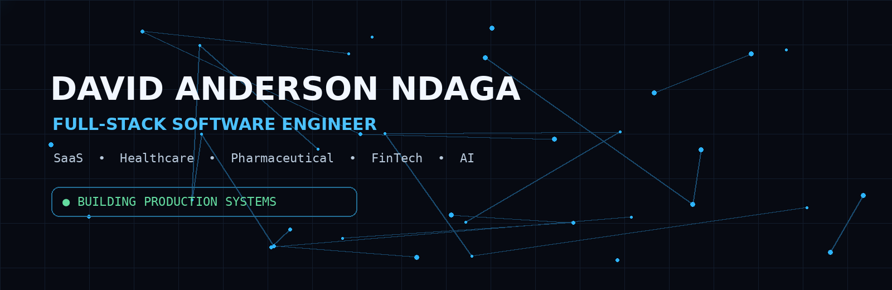

 

  

---

## `> whoami`

I'm a **Full-Stack Software Engineer** focused on designing, building, and deploying modern software systems across the **frontend, backend, APIs, databases, and infrastructure**.

I enjoy turning real-world problems into **scalable, secure, reliable, and maintainable products**.

My work spans **SaaS, healthcare, pharmaceutical technology, payments, realtime systems, business platforms, cloud infrastructure, and AI-powered applications**.

---

## ⚡ What I'm Building

<table>
<tr>
<td width="50%" valign="top">

### 🏥 Healthcare Technology

Building digital systems that improve healthcare operations, workflows, and access to technology.

**Focus:** healthcare platforms · operational systems · digital workflows

</td>
<td width="50%" valign="top">

### 💊 Pharmaceutical Technology

Engineering systems for pharmacy and pharmaceutical operations.

**Focus:** inventory · POS · procurement · supply chain · marketplaces

</td>
</tr>
<tr>
<td width="50%" valign="top">

### 🏢 SaaS & Business Platforms

Building scalable, reusable platforms that help businesses manage operations and workflows.

**Focus:** multi-tenancy · APIs · automation · business systems

</td>
<td width="50%" valign="top">

### 💳 Payment Infrastructure

Designing reusable payment integrations and transaction-processing infrastructure.

**Focus:** integrations · transactions · reliability · security

</td>
</tr>
<tr>
<td width="50%" valign="top">

### 🤖 AI-Powered Software

Integrating practical AI capabilities into real products.

**Focus:** NLP · RAG · LLMs · intelligent search · automation

</td>
<td width="50%" valign="top">

### ⚙️ Production Engineering

Building systems that are ready to operate beyond development.

**Focus:** containers · CI/CD · observability · security · reliability

</td>
</tr>
</table>

---

# 🧰 Tech Stack

  

---

# ⭐ Featured Engineering

<table>
<tr>
<td width="50%" valign="top">

## Brenox Engine

**Realtime communication infrastructure**

A Go backend for realtime communication with workspaces, channels, messaging, WebSockets, presence, notifications, voice/video signaling, developer APIs, and multi-instance deployment.

**Go · PostgreSQL · Redis · WebSockets · WebRTC · Docker · Kubernetes**

<a href="https://github.com/brainArt16/brenox-engine">View repository →</a>

</td>
<td width="50%" valign="top">

## Brenox SDK

**TypeScript client for Brenox**

A developer-facing SDK for integrating realtime communication capabilities into modern applications.

**TypeScript · React · WebRTC · Realtime APIs**

<a href="https://github.com/brainArt16/brenox-sdk">View repository →</a>

</td>
</tr>

<tr>
<td width="50%" valign="top">

## Brenox Python

**Python SDK for server-side integrations**

A Python SDK for integrating applications and services with the Brenox platform.

**Python · API Integration · SDK Engineering**

<a href="https://github.com/brainArt16/brenox-python">View repository →</a>

</td>
<td width="50%" valign="top">

## Ghost Factory

**Modern TypeScript engineering**

A TypeScript project demonstrating product-oriented application development and modern engineering practices.

**TypeScript · Full-Stack · Product Engineering**

<a href="https://github.com/brainArt16/ghost-factory">View repository →</a>

</td>
</tr>
</table>

---

# 📊 Engineering Activity

  

---

# 🟩 Contribution Graph

---

# 🤝 Let's Build

I'm open to collaborating on ambitious projects involving:

**Full-Stack Engineering · SaaS · Healthcare · Pharmaceutical Technology · FinTech · AI/ML · Realtime Systems · Developer Infrastructure · Open Source**

  

Build • Ship • Learn • Improve

  

